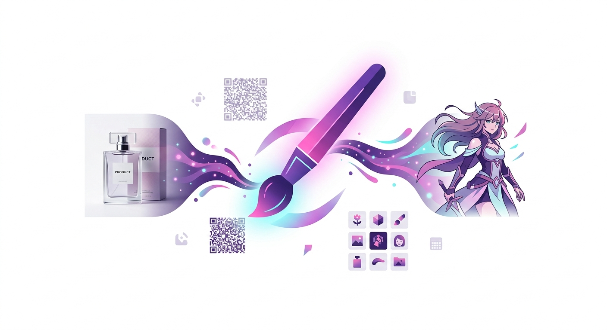
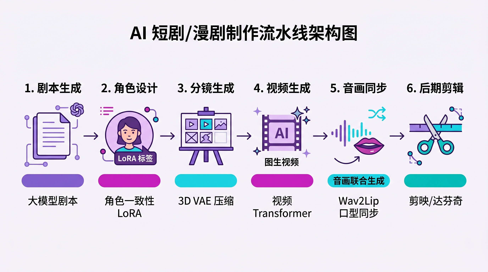
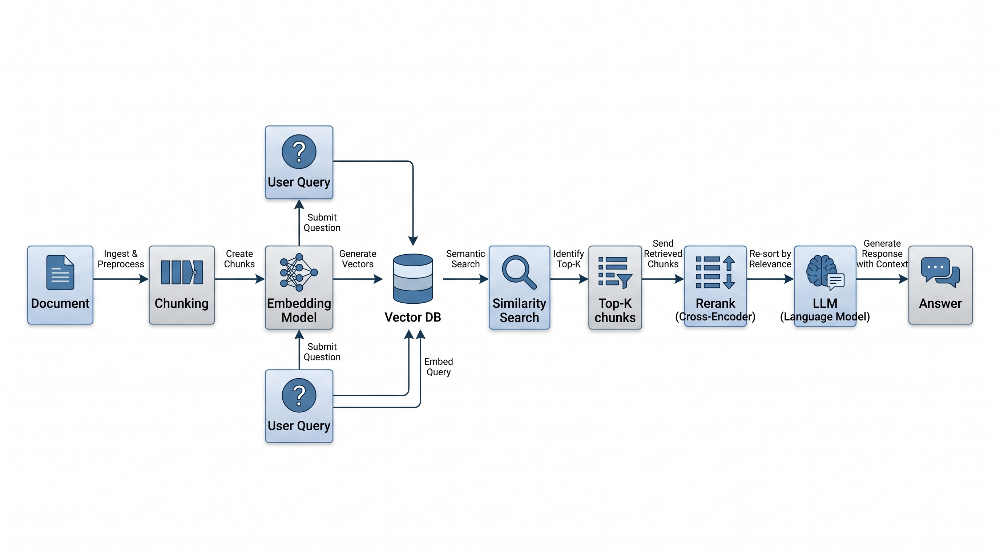
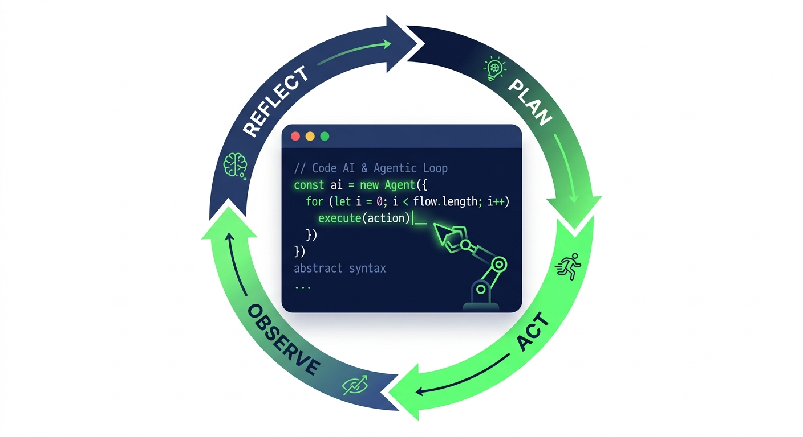
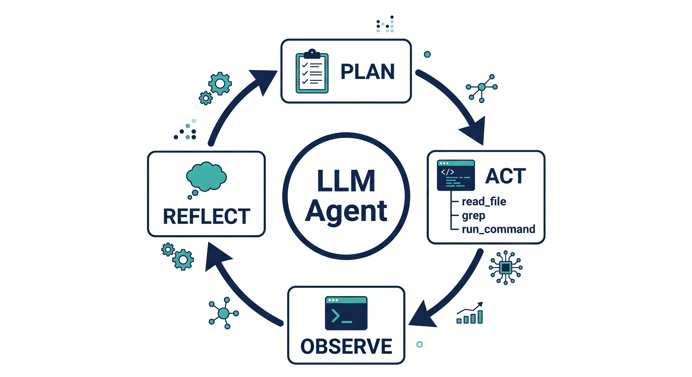
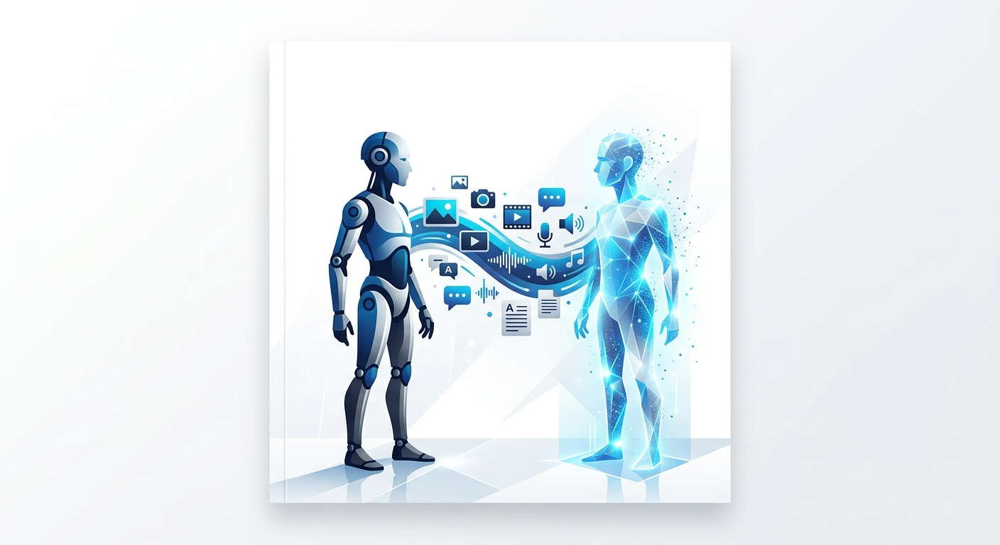
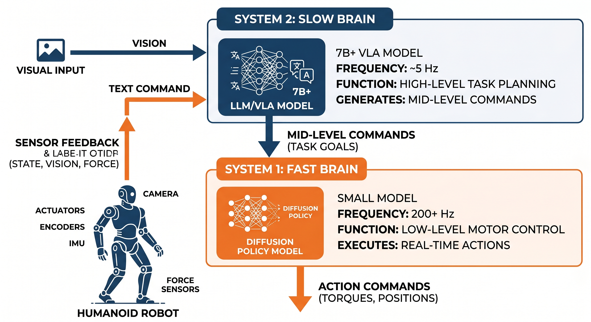
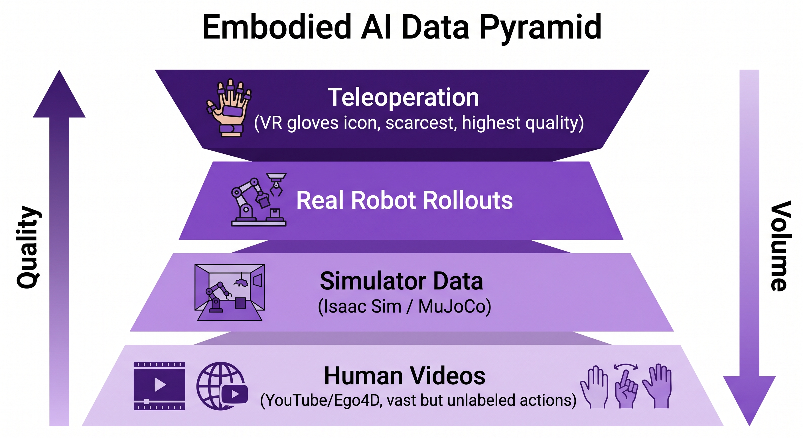

# AI 垂类业务场景调研报告

> 版本：2026-04-24 结构化改写版
> 覆盖垂类：图像 / 视频 / 音频 / 文本 / 代码 / 跨垂类融合
> 报告定位：面向产品 PM、技术选型决策者与高管的落地参考，不做百科式罗列

## 目录

- [一、摘要](#一摘要)
- [二、研究方法与口径说明](#二研究方法与口径说明)
- [三、共通技术栈速览](#三共通技术栈速览)
- [四、垂类场景深度分析](#四垂类场景深度分析)
- [五、横向对比](#五横向对比)
- [附录 A：官方链接汇总](#附录-a官方链接汇总)
- [附录 B：术语表](#附录-b术语表)

---

## 一、摘要

> [!summary] 报告速览
> **覆盖范围**：6 大垂类、60+ 主流应用、11 张配图、时间切片 2026-04。
> **核心判断**：2026 是 Agent + 具身智能商用元年；国产栈在场景化上已明显领先；选型核心是「能力边界 + 数据闭环 + 合规」三要素。

**三个核心结论**

1. **2026 是\"Agent + 具身智能商用元年\"**。长上下文稳定、推理模型可靠、工具调用协议（MCP）标准化三件事同时就位，LLM Agent 从 Demo 走向生产；VLA 模型压到 1–3B 端侧可跑 + 关节电机千元级，人形机器人进入客户验证阶段。
2. **国产栈在\"场景化\"上已明显领先**，尤其电商图（通义万相、爱创）、短剧（可灵、Seedance、HappyHorse）、数字人直播、代码助手（文心快码、通义灵码）；国际栈仍在\"通用能力上限\"上领先（Sora 2、Claude、GPT Image 1.5、Figure Helix）。
3. **选型核心不是\"谁更强\"，而是\"能力边界 + 数据闭环 + 合规\"**。跨境优先国际旗舰 + 可本地部署开源；国内 C 端与企业内网必选国产合规栈；数据敏感行业必选可私有化微调的本地化方案。

**选型建议一句话版**

- 最高画质 / 文字渲染 / 可控性 → **GPT Image 1.5 + Midjourney V7**
- 数据敏感、要求私有化 → **SDXL/Flux + ControlNet + LoRA**（图像）/ **Comate、通义灵码**（代码）/ **Milvus + BGE-M3**（RAG）
- 电商短视频、短剧规模化 → **可灵 3.0 + Seedance 2.0 + ComfyUI**
- 企业级 Agent → **[OpenAI Responses API](https://platform.openai.com/docs/api-reference/responses)**（国际）或 **通义千问 Agent / 豆包**（国内合规）
- 数字人直播 → **[HeyGen](https://www.heygen.com/)**（出海 175+ 语种）/ **小冰**（国内）

> [!warning] 重要迁移提醒
> - **OpenAI Assistants API** 将于 **2026-08-26** 关停，基于它的项目须迁至 Responses API
> - **DALL-E 3 API** 将于 **2026-05-12** 关停，自动回落至 GPT Image

---

## 二、研究方法与口径说明

| 项 | 说明 |
| --- | --- |
| **数据来源** | 官方产品页 / 官方博客 / 主流研报（DataEye、艾媒咨询、IDC）/ Artificial Analysis、LM Arena 榜单 / 厂商财报 / 公开媒体 |
| **核验方式** | 链接可达性检查、官方版本号核对、价格/额度点查、争议数据交叉比对 |
| **时间窗口** | 截至 2026-04-24 |
| **营销话术处理** | 厂商口径的增长率、留存率、转化率均明示\"厂商口径\"，不作为选型决策依据 |
| **不作为本报告依据** | 社媒截图、SEO 稿、无出处的榜单、未经核实的\"内部数据\" |

---

## 三、共通技术栈速览

本节抽离各垂类共用的\"积木\"，后文场景内不再重复解释。

### 3.1 基础模型家族

| 模态 | 主流主干 | 代表模型 |
| --- | --- | --- |
| 图像 | Latent Diffusion / DiT / Flow Matching | SDXL、Flux.1、HunyuanDiT、GPT Image 1.5 |
| 视频 | 3D VAE + Video DiT | Sora 2、可灵 3.0、Seedance 2.0、HappyHorse |
| 音频 TTS | 自回归 LM + Neural Codec / 扩散 / Flow Matching | VALL-E、ChatTTS、F5-TTS、Fish S1、MiniMax Speech |
| 文本 LLM | Transformer + 推理模型 | GPT / Claude / Gemini、通义千问、豆包、DeepSeek、文心 |
| 具身 | VLA（Vision-Language-Action） | RT-2、OpenVLA、Figure Helix、智元 GO-1 |

### 3.2 控制与定制手段（与主干解耦的\"旁路\"）

- **ControlNet**：空间结构控制（姿态/边缘/深度）
- **LoRA**：低秩微调，几十 MB 记住品牌视觉 / 角色形象 / 专属语音
- **IP-Adapter**：用一张参考图做图像 prompt
- **Function Calling / Tool Use**：让模型稳定调用外部工具
- **MCP（Model Context Protocol）**：Anthropic 主导、2025 被广泛采用的工具调用标准

### 3.3 工程增强栈

- **RAG 管线**：Chunking → Embedding → 向量索引（HNSW/IVF-PQ）→ Cross-Encoder 重排 → LLM 合成
- **Agentic Loop**：`Plan → Act → Observe → Reflect`，ReAct 为事实标准
- **长短期记忆**：短期对话缓存 + 长期向量记忆 + 周期性摘要
- **推理模型**（o1/o3/DeepSeek-R1）：为 Plan-Reflect 循环提供可靠性
- **Sim2Real**：Domain Randomization 让仿真策略迁移到真实硬件

### 3.4 评测基线

| 模态 | 主流榜 | 备注 |
| --- | --- | --- |
| 图像 | LM Arena Text-to-Image、Artificial Analysis | GPT Image 1.5 2026-03 ELO 1264 第一 |
| 视频 | Artificial Analysis Video Arena | HappyHorse ELO 1333–1413 |
| 文本 | MMLU、GPQA、Chatbot Arena | 2026 主流模型已普遍饱和 MMLU |
| 代码 | HumanEval（饱和）/ SWE-bench Verified / Terminal-Bench | 2026 SWE-bench SOTA 70%+ |
| 具身 | RT-2 Eval、CALVIN、RoboCasa | 仍以厂商任务集为主 |

---

## 四、垂类场景深度分析

统一四段式：**场景价值 / 应用对比（五维） / 技术要点 / 调研结论**。

### 4.1 图像 AI

#### 4.1.1 电商产品图生成

> [!info] 场景价值
> 让 1 个运营单日素材产出从 5 张提升到 500 张，覆盖主图/场景图/详情页/套图。

**🔍 应用对比（五维）**

| 应用 | 能力边界 | 成本 | 数据闭环（可私有化微调） | 合规 / 数据出境 | 生态绑定成本 |
| --- | --- | --- | --- | --- | --- |
| **[SDXL](https://stability.ai/)/[Flux](https://blackforestlabs.ai/) + [ControlNet](https://github.com/lllyasviel/ControlNet)** | 开源、可控最强；需自搭管线 | GPU 自担（免费软件） | ✅ 完全可私有化 + LoRA 微调 | ✅ 可完全本地 | 低（开源生态） |
| **[GPT Image 1.5](https://openai.com/)** | 文字渲染 / 提示词还原最强 | API $0.04–0.08/张 | ❌ 不可微调 | ❌ 数据出境 | 中（绑 OpenAI） |
| **[通义万相](https://tongyi.aliyun.com/wanxiang)** | 电商场景深度调优；服装上身 | 按量计费 | 部分（行业模型） | ✅ 境内合规 | 高（绑阿里系） |
| **[文心一格](https://yige.baidu.com/)**（已并入文心一言） | 中文/国风；合规 | 免费+付费 | 部分 | ✅ 境内合规 | 中 |
| **[爱创 AI](https://www.51aic.com/)** | 1688 星工具；一键全店 | 低门槛 | ❌ | ✅ | 高（绑 1688） |

**📌 技术要点**（本场景特有；通用部件见 §3）

- 链路固定为 **SDXL/Flux 主干 + ControlNet + LoRA + IP-Adapter**：ControlNet 锁结构、LoRA 锁身份，解决\"同一沙发多场景\"一致性
- 电商特有需求：白底去背景 → 场景合成；服装平铺图 → 模特上身；多 SKU 批量换色
- 纯 T2I 不足以覆盖电商一致性，必须引入条件控制

> [!abstract] 调研结论
> - **成熟度**：✅ 生产可用
> - **ROI 拐点**：日均素材需求 > 50 张的商家全面正收益
> - **主要风险**：品牌视觉\"模型味\"、侵权素材训练、与模特形象权纠纷
> - **倾向性选型**：跨境 → SDXL + LoRA 自训；淘系 → 通义万相；1688 → 爱创；品牌营销 → GPT Image 1.5

---

#### 4.1.2 艺术创作与概念设计

> [!info] 场景价值
> 设计师加速概念探索、封面物料与风格实验。

**🔍 应用对比**

| 应用 | 能力边界 | 成本 | 可私有化 | 合规 | 生态绑定 |
| --- | --- | --- | --- | --- | --- |
| **[Midjourney V7 / V8-Alpha](https://www.midjourney.com/)** | 艺术表现力标杆 | Basic $10/月起 | ❌ | ❌ 境外 | 低（Discord/Web） |
| **[GPT Image 1.5](https://openai.com/)** | 透视/光照/文字皆佳 | API 约 $0.04–0.08/张 | ❌ | ❌ 境外 | 中 |
| **Stable Diffusion / Flux** | 开源；风格 LoRA 丰富 | 免费 | ✅ | ✅ | 低 |

**📌 技术要点**：本场景直接复用 §3 主干模型 + LoRA；无场景专属技术。

> [!abstract] 调研结论
> - **成熟度**：✅ 生产可用（仅\"概念稿\"级别，最终交付仍需人工把关）
> - **ROI 拐点**：依赖大量原画/概念图的团队立即正收益
> - **主要风险**：版权归属、风格抄袭争议
> - **倾向性选型**：创意优先 → Midjourney；文字/多模态 → GPT Image 1.5；本地可控 → Flux

---

#### 4.1.3 AI 动漫 / 二次元

> [!info] 场景价值
> 同人 / VTuber / 轻小说插画 / 社区内容的工业化产出。

**🔍 应用对比**

| 应用 | 能力边界 | 成本 | 可私有化 | 合规 | 生态 |
| --- | --- | --- | --- | --- | --- |
| **[NovelAI](https://novelai.net/)** | 二次元纯度最高；Danbooru 标签 | Tablet $10 / Scroll $15 / Opus $25 | ❌ | ❌ 境外 | 中 |
| **[Midjourney Niji](https://www.midjourney.com/)** | 官方动漫模式 | $10–60/月 | ❌ | ❌ 境外 | 低 |
| **[触站 AI](https://www.czhanai.com/)** | 国内最大二次元社区；中文 prompt | 免费 + ¥19–49 | ❌ | ✅ | 中 |
| **[画宇宙](https://creator.nolibox.com/)** | 多风格模型 | 免费 + ¥29–99 | ❌ | ✅ | 中 |
| **[吐司 AI](https://tusi.cn/)** | 丰富社区 LoRA | 免费 + ¥24.9–39.9 | ❌ | ✅ | 中 |
| **[Animagine XL 3.1](https://huggingface.co/cagliostrolab/animagine-xl-3.1)** | 开源动漫专精 SDXL | 免费 | ✅ | ✅ | 低 |

**📌 技术要点**（本场景特有）

- **Danbooru 标签体系**：二次元模型的 prompt 形态是 `1girl, long_hair, ...` 这类标签拼接（训练语料决定）
- **角色一致性 LoRA**：20–50 张素材 → 几小时训练 → 专属角色 LoRA
- **负面提示词**：`bad hands, extra fingers, watermark, lowres` 比其他场景更关键

> [!abstract] 调研结论
> - **成熟度**：✅ 生产可用
> - **ROI 拐点**：任何规模化内容生产团队
> - **主要风险**：IP 侵权、未成年人画风合规
> - **倾向性选型**：跨境同人 → NovelAI；国内直连 / 成本敏感 → 吐司、触站；完全自主 → Animagine XL

---

#### 4.1.4 生成式视觉浏览器（实验阶段）

> [!info] 场景价值
> 把\"浏览网页\"变成\"翻一本无限生成的图画书\"——对\"图像即界面\"的概念验证。

**代表产品：Flipbook**（https://flipbook.page/）

- 所有内容（含文字）均由图像模型实时渲染
- \"点击图像中的物体\"=下一次生成的 prompt
- 可选 Live Video Stream：连续动画流
- 作者：Zain Shah、Eddie Jiao、Drew Carr

**📌 技术要点**：本场景本身是 §3 图像主干能力的\"体验形态\"创新，无独立新技术。

> [!abstract] 调研结论
> - **成熟度**：🧪 实验阶段
> - **ROI 拐点**：尚未商业化；推理成本需降 10x
> - **主要风险**：无状态持久化、资源消耗高、交互可预测性低
> - **倾向性选型**：不建议生产环境；适合做\"生成式 UI/OS\"方向的技术前瞻

---

### 4.2 视频 AI

#### 4.2.1 电商带货短视频

> [!info] 场景价值
> URL → 商品图 → 带货短视频的自动化流水线，降低达人成本。

**🔍 应用对比**

| 应用 | 能力边界 | 成本 | 可私有化 | 合规 | 生态 |
| --- | --- | --- | --- | --- | --- |
| **[Runway Gen-4.5 / GWM-1](https://runwayml.com/)** | Motion Brush；1080p 原生 / 4K 升采样 | 订阅制 | ❌ | ❌ 境外 | 中 |
| **[Luma Ray3 / UNI-1](https://lumalabs.ai/)** | 生成极速 | 订阅制 | ❌ | ❌ 境外 | 中 |
| **[OpenAI Sora 2](https://openai.com/sora)** | 最长 25s（Pro），1080p；Character Cameo | Pro 订阅 | ❌ | ❌ 境外 | 高 |
| **[快手可灵 3.0](https://klingai.kuaishou.com/)** | 最长 15s；智能分镜；4K 原生 | 按量 | ❌ | ✅ | 高（绑快手） |
| **[字节 Seedance 2.0（即梦）](https://jimeng.jianying.com/)** | 4–15s；抖音直出 | 按量 | ❌ | ✅ | 高（绑字节） |
| **[沃创 Wocreate](https://wocreate.ai/)** | URL → 带货视频；Agent 模板 | 按量 | ❌ | ✅ | 中 |
| **阿里 HappyHorse-1.0** | 2026-04-09 开源；15B；音画同生；ELO 1333–1413 | 开源 + 算力自担 | ✅ | ✅ | 低 |
| **[Vidu](https://www.vidu.cn/)** | 多主体一致性 | 订阅 | ❌ | ✅ | 中 |
| **[Pika](https://pika.art/)** | 高保真表情；音频同步 | 订阅 | ❌ | ❌ 境外 | 中 |

**📌 技术要点**

- **I2V（图生视频）远多于 T2V**：国内商用几乎全是\"先生图再驱动\"，可控性远高于纯文生视频
- **Motion Brush / 智能分镜**：电商短视频特有的\"商品锁定不偏移\"需求

> [!abstract] 调研结论
> - **成熟度**：🟡 商用试点→生产可用（头部卖家已规模化）
> - **ROI 拐点**：日均 10 条以上带货短视频的中腰部商家
> - **主要风险**：人物动作失真、商品变形、平台投流规则
> - **倾向性选型**：抖音 → Seedance；快手 → 可灵；跨境 → Runway / Sora 2；自研 → HappyHorse 开源

---

#### 4.2.2 AI 漫剧 / 仿真人短剧

> [!info] 场景价值
> 把\"百万预算一集\"压到\"几千块 + 几十小时\"的内容工业化。

**市场数据**

- **2025 市场规模**：**约 168 亿元**（DataEye），2026 预计 240 亿
- **已核实爆款**：《斩仙台下，我震惊了诸神！》抖音播放 **11.5 亿** ✅

**🔍 应用对比**

| 应用 | 能力边界 | 成本 | 可私有化 | 合规 | 生态 |
| --- | --- | --- | --- | --- | --- |
| **[Seedance 2.0 / 即梦](https://jimeng.jianying.com/)** | 抖音生态；写实风格 | 按量 | ❌ | ✅ | 高（字节） |
| **[可灵 3.0 + LoRA](https://klingai.kuaishou.com/)** | 仿真人短剧主力 | 按量 | 部分（LoRA） | ✅ | 高（快手） |
| **[ComfyUI](https://www.comfy.org/zh-cn/)** | 本地节点式；控制力最强 | 免费（+GPU） | ✅ | ✅ | 低 |
| **[万彩动画大师](https://www.animiz.cn/)** | MG 动画 + 照片数字人；非 AI 生成 | 会员 | N/A | ✅ | 低 |

**📌 技术要点**（本场景特有）

- **3D VAE**：时间+空间双下采样（如 4×8×8），把 10s 1080p 压到几千 token
- **Video DiT**：Transformer 时空联合建模，取代早期 U-Net + 时序注意力
- **角色一致性 LoRA**：跨集跨镜头不漂移的核心
- **音画联合生成**：HappyHorse / Sora 2 同一 Transformer 内同时生成视频与音频 token
- **15s 瓶颈**：3D Attention 算力随序列平方增长；Sora 2 的 25s 靠稀疏注意力 + 显存工程

> [!abstract] 调研结论
> - **成熟度**：🟡 商用试点（头部已上线，腰部高度依赖人工修片）
> - **ROI 拐点**：单剧目标播放 > 1000 万
> - **主要风险**：人物\"塑料感\"、镜头连续性、平台审核
> - **倾向性选型**：抖音 → Seedance；快手 → 可灵；完全自控 → ComfyUI + HappyHorse

---

### 4.3 音频 AI

#### 4.3.1 有声书与播客

> [!info] 场景价值
> 把长文本（小说/研报/公众号）低成本转为拟真度高的音频内容。

**🔍 应用对比**

| 应用 | 能力边界 | 成本 | 可私有化 | 合规 | 生态 |
| --- | --- | --- | --- | --- | --- |
| **[ElevenLabs](https://elevenlabs.io/)** | Eleven v3；70+ 语言；拟真极高 | 订阅制 | ❌ | ❌ 境外 | 中 |
| **[Play.ht](https://play.ht/)** | 品牌语音定制；SSML；800+ 音色，140+ 语言 | 订阅 | ❌ | ❌ 境外 | 中 |
| **[Fish Audio](https://fish.audio/)** | 情感表现力强 | 免费 8000 credits/月（~7 分钟，500 字/次） | 部分（开源 Fish S1） | 中 | 低 |
| **[冬瓜配音](https://www.okaidub.com/)** | 多角色；方言丰富 | 会员 | ❌ | ✅ | 中 |
| **百宝音** | 三端；多音字修正 | 免费+会员 | ❌ | ✅ | 低 |
| **[MiniMax Speech 2.6](https://www.minimaxi.com/)** | 低延迟；高情感 | 付费 | ❌ | ✅ | 中 |
| **[ChatTTS](https://github.com/2noise/ChatTTS)** | 开源 | 代码 AGPLv3；**模型 CC BY-NC 4.0**，仅非商用 | ✅ | ✅ | 低 |

**📌 技术要点**

- **Neural Audio Codec**（EnCodec / SoundStream / Mimi）：把音频压成离散 token，让 LLM 能像写文字一样写音频 —— 零样本克隆的基石
- **两类 TTS 范式**：
  - 自回归 LM + Codec（VALL-E、ChatTTS）：韵律自然，但长文本有漏读风险
  - 扩散 / Flow Matching（F5-TTS、Fish S1）：并行快且稳，情感略弱
  - 2026 商用产品多为混合路线
- **零样本克隆**：ECAPA-TDNN 提取 3–10s 说话人 embedding → 作为 LM prompt 前缀
- **AI 播客范式**：长文本 → LLM 生成双 agent 对话脚本（带口语停顿）→ 多说话人 TTS 合成

> [!abstract] 调研结论
> - **成熟度**：✅ 生产可用
> - **ROI 拐点**：内容平台、培训公司、有声书厂
> - **主要风险**：声音权、深度伪造、商用授权（ChatTTS 陷阱）
> - **倾向性选型**：多语种跨境 → ElevenLabs；国内长期运营 → 冬瓜、MiniMax；低成本探索 → Fish Audio；严格非商用 → ChatTTS

---

#### 4.3.2 AI 播客听书

**代表**：书尖 AI（阿里云底座，双主持人模式，1.2 亿册书库）

**调研结论**：🟡 商用试点；关键看留存与商业化，而非生成能力本身。

---

### 4.4 文本 AI

#### 4.4.1 企业知识库与 RAG

> [!info] 场景价值
> 把零散的规章 / 工单 / 手册 / 代码文档变成可问答的\"企业大脑\"，替代 30–50% 的初级客服 / IT 支持工作。

**应用对比（向量数据库）**

| 库 | 能力边界 | 成本 | 可私有化 | 合规 | 生态 |
| --- | --- | --- | --- | --- | --- |
| **[FAISS](https://github.com/facebookresearch/faiss)** | 中小（百万级）；算法库非服务 | 免费 | ✅ | ✅ | 低 |
| **[Milvus](https://milvus.io/)** | 大（千万级+） | 免费 / 企业版 | ✅ | ✅ | 中 |
| **[Pinecone](https://www.pinecone.io/)** | 中；云 SaaS | 订阅制 | ❌ | ❌ 境外 | 高 |
| **[Qdrant](https://qdrant.tech/)** | 中大；云 + 本地 | 免费 / 云付费 | ✅ | ✅ | 中 |

**📌 技术要点**

- **Embedding**：BGE-M3（多语）、E5、OpenAI text-embedding-3、Jina v3
- **Chunking 策略**：固定长 / 语义 / 递归 / **Late Chunking**（先整段过 embedding 再切向量）
- **索引**：HNSW 主力；大规模用 IVF-PQ 省显存
- **Rerank**：Cross-Encoder 二次精排是**提升准确率最明显的单一步骤**（bge-reranker-v2、Cohere Rerank）
- **Graph RAG**：抽实体关系构图，支持多跳推理（微软 GraphRAG、LightRAG）
- **Agentic RAG**：让模型自主决策是否检索、检索什么、何时停止 —— 2026 主流演进方向
- 常见坑：召回分数高 ≠ 答案对；prompt 注入；更新后的全量重建成本

> [!abstract] 调研结论
> - **成熟度**：✅ 生产可用
> - **ROI 拐点**：文档 > 1000 篇、日均问答 > 100 次的企业
> - **主要风险**：召回失准、答非所问、数据权限控制
> - **倾向性选型**：境内企业 → Milvus + BGE-M3 + bge-reranker；跨境 SaaS → Pinecone + OpenAI Embedding

---

#### 4.4.2 LLM Agent（智能体）

> [!info] 场景价值
> 从\"回答问题\"升级为\"完成任务\"，覆盖工单处理、数据分析、运营自动化。

**🔍 应用对比**

| 平台 | 能力边界 | 成本 | 可私有化 | 合规 | 生态 |
| --- | --- | --- | --- | --- | --- |
| **[OpenAI Responses API](https://platform.openai.com/docs/api-reference/responses)** | 2026 当前推荐栈 | API | ❌ | ❌ 境外 | 高 |
| ~~**OpenAI Assistants API**~~ | **已弃用**；2026-08-26 关停 | — | ❌ | ❌ | — |
| **[LangChain](https://www.langchain.com/)** | 开源编排框架 | 免费 | ✅ | ✅ | 低 |
| **[AutoGPT](https://github.com/Significant-Gravitas/AutoGPT)** | 开源；自主任务 | 免费 | ✅ | ✅ | 低 |
| **[文心智能体平台](https://agents.baidu.com/)**（百度） | 中文生态；合规 | 按量 | 部分 | ✅ | 中 |
| **[通义千问 Agent](https://tongyi.aliyun.com/)**（阿里） | 阿里云生态 | 按量 | 部分 | ✅ | 中 |
| **[腾讯元宝](https://yuanbao.tencent.com/) / [豆包](https://www.doubao.com/) / [文小言](https://yiyan.baidu.com/)** | C 端入口；消费级 | 免费+增值 | ❌ | ✅ | 低 |

**📌 技术要点**

- **Function Calling**：结构化 JSON Schema 稳定调外部工具 —— Agent 的\"手\"
- **ReAct**：`Reason → Act → Observe → Reason...`，开源事实标准
- **规划**：LLM Compiler、Plan-and-Execute、Tree of Thoughts
- **记忆**：短期对话 + 长期向量 + 周期摘要（防上下文爆炸）
- **推理模型**：o1 / o3 / DeepSeek-R1 把 Plan-Reflect 拉到可生产级
- **MCP**：2025 被广泛接受的工具调用协议，跨模型复用
- **2026 是\"Agent 商用元年\"**：长上下文稳（100K+ 不降智）+ 推理强 + 工具协议标准化

> [!abstract] 调研结论
> - **成熟度**：🟡 商用试点
> - **ROI 拐点**：高度重复、规则明确、有 API 可接的工作流
> - **主要风险**：幻觉级联、工具调用失败、审计追踪缺失
> - **倾向性选型**：快速原型 → Responses API；本地可控 → LangChain + 开源 LLM；国内合规 → 通义 / 文心 Agent

---

### 4.5 代码 AI

#### 4.5.1 智能代码生成与补全

> [!info] 场景价值
> 从\"写代码\"升级为\"描述意图 + 审核变更\"，头部团队研发提效 30–60%（口径见原数据）。

**🔍 应用对比**

| 应用 | 能力边界 | 成本 | 可私有化 | 合规 / 代码出境 | 生态 |
| --- | --- | --- | --- | --- | --- |
| **[GitHub Copilot](https://github.com/features/copilot)** | 官方研究小任务提速 **55.8%**（95% CI 21–89%，p=0.0017） | 订阅 | ❌ | ❌ 境外 | 高 |
| **[Cursor](https://cursor.com/)** | 项目级上下文；Fusion 预测 | 订阅 | ❌ | ❌ 境外 | 中 |
| **[Windsurf](https://windsurf.com/)**（Cognition, Inc.） | 前 Codeium；2025-07 Google acquihire 关键团队，Cognition 收购剩余业务 | 订阅 | ❌ | ❌ 境外 | 中 |
| **[Trae](https://www.trae.ai/)**（字节） | 基于 VSCode 的独立 AI IDE | 免费+付费 | ❌ | ✅ | 中 |
| **[Qodo](https://www.qodo.ai/)**（原 CodiumAI） | 测试/质量导向 | 订阅 | ❌ | ❌ 境外 | 中 |
| **[Replit](https://replit.com/)** | 在线 IDE + Agent | 订阅 | ❌ | ❌ 境外 | 高 |
| **[文心快码 Comate](https://comate.baidu.com/)** | IDC C++ 代码生成第一；百度内部提效 60% | 企业/个人 | ✅ 可本地化 | ✅ | 中 |
| **[通义灵码](https://tongyi.aliyun.com/lingma)** | 200+ 语言；阿里云生态 | 企业/个人 | 部分 | ✅ | 中 |
| **[腾讯云 CodeBuddy](https://copilot.tencent.com/)** | 腾讯云生态 | 企业/个人 | 部分 | ✅ | 中 |

**📌 技术要点**

- **Fill-in-the-Middle（FIM）**：训练时把代码切成\"前缀+后缀+中段\"，让模型学会\"在光标处补中间\"
- **仓库级上下文四路线**：
  - 向量化检索（Cursor、Windsurf）
  - Agentic Search：主动 grep / find / read_file（Claude Code、Codex CLI、Comate Zulu）
  - AST / 依赖图
  - 长上下文直灌（Gemini 路线，成本高）
- **Agentic Coding Loop**：`Plan → Act → Observe → Reflect`，Claude 3.5/4 Sonnet 把工具调用稳定性拉到生产级，是 2025 拐点
- **SPEC 规范驱动**（Comate / Amazon Kiro）：先生成任务规格 + 变更预览再落盘，解决\"Vibe Coding\"幻觉与误删
- **Benchmark 演进**：HumanEval（饱和）→ SWE-bench Verified（2026 SOTA 70%+）→ Terminal-Bench / OSWorld

> [!abstract] 调研结论
> - **成熟度**：✅ 生产可用
> - **ROI 拐点**：≥ 10 人的工程团队；核心代码库复杂度中等以上
> - **主要风险**：代码外泄、幻觉 API、依赖引入安全漏洞
> - **倾向性选型**：
  - 数据不敏感 + 追求 SOTA → **Cursor / Claude Code / Copilot**
  - 国内企业 / 数据敏感 → **文心快码 / 通义灵码 / 腾讯 CodeBuddy**
  - 完全自研 → 开源模型 + Continue.dev

---

#### 4.5.2 AI 代码审查 / 4.5.3 自动化测试 / 4.5.4 DevOps

**代码审查**：[SonarQube](https://www.sonarsource.com/products/sonarqube/) / [DeepSource](https://deepsource.com/) / [Snyk Code](https://snyk.io/product/snyk-code/) / 百度 iCode 智能 CR（内部）

**自动化测试**：[TestRigor](https://testrigor.com/)（纯自然语言 + 自愈）/ [Applitools](https://applitools.com/)（视觉回归）/ [Parasoft](https://www.parasoft.com/)（C/C++ MC/DC）

**DevOps**：需求（iCafe/Jira）→ 代码（Comate）→ 提交 → AI CR → 流水线 → 监控；百度内部口径研发效能 +60%、部署频率 5×、MTTR -80%

> [!abstract] 调研结论
> - **成熟度**：✅ 生产可用（代码审查、测试生成）；🟡 端到端 DevOps 仍在完善
> - **主要风险**：规则误报、回归遗漏、CI 时长膨胀
> - **倾向性选型**：先落地 AI CR（立即见效），再落地测试生成，最后才是端到端 Agent 化

---

### 4.6 跨垂类融合

#### 4.6.1 多模态内容创作

**代表**：豆包（字节）—— 文+图+视频+音频一体化；抖音 / 今日头条整合。

**调研结论**：✅ C 端生产可用；B 端需自拼管线。

---

#### 4.6.2 数字孪生 / 虚拟世界

**典型组合**：图像（纹理）+ 视频（动画）+ 音频（NPC）+ 文本（剧情）+ 代码（逻辑）。

**调研结论**：🟡 垂直行业试点（工业、文旅）；通用方案未定型。

---

#### 4.6.3 AI 数字人直播

> [!info] 场景价值
> 7×24 低成本直播、深夜长尾转化、出海多语言带货。

**🔍 应用对比**

| 应用 | 能力边界 | 成本 | 可私有化 | 合规 | 生态 |
| --- | --- | --- | --- | --- | --- |
| **[HeyGen](https://www.heygen.com/)** | 175+ 语言与方言；LiveAvatar 低延迟 | 订阅 | ❌ | ❌ 境外 | 中 |
| **[小冰数字人](https://www.xiaoice.com/)** | 数字员工 / 虚拟人系列 | 商务报价 | 部分 | ✅ | 中 |

**市场规模**（艾媒咨询白皮书）：**2025 年核心市场 480.6 亿元**（非 2026），产业 6402.7 亿元。

**📌 技术要点**

- **形象建模**：3D 建模 + 骨骼绑定 → NeRF / 3D Gaussian Splatting 神经渲染（拍几分钟视频即可重建）
- **口型同步**：Wav2Lip、MuseTalk、SadTalker
- **实时 TTS**：首字延迟 < 300ms + 流式（MiniMax Speech 2.6、Fish S1）
- **对话大脑**：LLM + RAG 接商品库 / 话术库
- **实时推流**：RTMP / HLS 到抖音 / 快手
- **本质是具身智能的 2D 简化版**：输出空间从关节角变成面部关键点 + 肢体动作

> [!abstract] 调研结论
> - **成熟度**：✅ 生产可用（规模化运营）
> - **ROI 拐点**：单账号月 GMV > 10 万的带货商家
> - **主要风险**：肖像权、平台规则、直播间互动自然度
> - **倾向性选型**：出海 → HeyGen；国内 → 小冰 / 各云厂商数字人产品

---

#### 4.6.4 具身智能 / 人形机器人

> [!info] 场景价值
> 2026 被业界视为\"具身智能商用元年\"；目标场景是工厂上下料、家庭清洁、物流分拣。

**技术栈速览**

| 层 | 对应垂类 | 能力 |
| --- | --- | --- |
| 感知大脑 | 视频 + 音频 AI | 视觉识别、深度感知、声源定位 |
| 决策大脑 | 文本 AI（LLM Agent） | 任务规划、推理 |
| 世界模型 | 多模态 | 物理规律、因果推理 |
| 运动小脑 | 代码 AI | 运动控制、力反馈 |
| 硬件执行 | 机电 | 精密抓取、双足 |

**代表企业**

**中国**
- **智元 AGIBOT**（https://www.agibot.com.cn/ | https://www.agibot.com/）
  - 产品线：**远征 / 灵犀 / 精灵 / 酷拓（四足）/ 绝尘（清洁）/ OmniHand**
  - 营收（APC 2026 官方）：2023 ~30 万 → 2024 ~6000 万 → **2025 10.5 亿**；**2027 目标破 100 亿**
  - **AIMA** 架构 2026-04-17 APC 首发
- **[优必选](https://www.ubtrobot.com/)**：https://www.ubtrobot.com/
- **未来不远 Futuring Robot**：家庭服务；2026-01 完成 2 亿天使轮；端到端 AVLA

**国际**
- **[Figure AI](https://www.figure.ai/)**：2025-02-04 已终止与 OpenAI 合作，改用自研 Helix（VLA）；Figure 02 已部署 BMW Spartanburg
- **[Tesla Optimus](https://www.tesla.com/optimus)**：Gen 3 低量产 2026 夏（Fremont），高量产 2027 夏（Giga Texas，规划年产 1000 万台）

**📌 技术要点**

- **VLA 大模型**：多路摄像头 + 文本指令 + 本体状态 → 关节 / 末端动作 tokens，端到端替代\"感知→规划→控制\"三段式（RT-2、OpenVLA、Figure Helix、智元 GO-1）
- **分层 VLA（System 1 + System 2）**：
  - System 2 慢脑：7B+ 做规划，几 Hz
  - System 1 快脑：小模型 / Diffusion Policy 出动作，200 Hz
  - Figure Helix、Physical Intelligence π0 路线
- **世界模型**：脑内预演物理再决策，也用于仿真数据（V-JEPA2、GWM-1、1X World Model）

- **数据金字塔**：遥操作（最稀缺最高质）→ 真实 rollouts → 仿真数据 → 人类视频（Ego4D/YouTube）—— 谁能把人类视频高质量转成动作标签，谁就赢数据战
- **Sim2Real**：Domain Randomization（随机化光照 / 摩擦 / 重力）
- **2026 商用元年三件事**：VLA 压到 1–3B 端侧跑通 + 数据飞轮 + 关节电机降至千元级 + 政策 / 资本共振

> [!abstract] 调研结论
> - **成熟度**：🟡 商用试点（工厂上下料）→ 🧪 家庭场景仍实验
> - **ROI 拐点**：人力替代成本 / 单台硬件成本 < 3 年（当前多数场景尚未达到）
> - **主要风险**：硬件可靠性、安全事故、法律责任界定、数据不足
> - **倾向性选型**：采购方\"先用四足 + 机械臂打通流程，再等人形量产\"

---

## 五、横向对比

### 5.1 国际→国内对标速查

| 垂类 | 国际代表 | 国内对标 |
| --- | --- | --- |
| 图像（通用） | GPT Image 1.5 / Midjourney V7 | 通义万相 / 文心一格 / 吐司 |
| 图像（二次元） | NovelAI / Niji | 触站 / 画宇宙 / 吐司 |
| 视频（通用） | Sora 2 / Runway Gen-4.5 / Ray3 | 可灵 3.0 / Seedance 2.0 / HappyHorse |
| 视频（电商 Agent） | — | 沃创 Wocreate |
| 音频（TTS） | ElevenLabs / Play.ht | MiniMax / 冬瓜配音 / Fish（半国内） |
| 文本（LLM） | GPT / Claude / Gemini | 通义千问 / 豆包 / 文心 / DeepSeek |
| 文本（Agent） | OpenAI Responses API / LangChain | 文心智能体 / 通义 Agent / 元宝 |
| 代码 | Copilot / Cursor / Windsurf / Claude Code | 文心快码 / 通义灵码 / 腾讯 CodeBuddy / Trae |
| 数字人直播 | HeyGen | 小冰 / 各云厂商 |
| 人形机器人 | Figure / Tesla Optimus / π | 智元 / 优必选 / 未来不远 |

### 5.2 成本分档

| 分档 | 代表应用 |
| --- | --- |
| **免费** | SDXL / Flux / Animagine / ComfyUI、ChatTTS（非商用）、FAISS、AutoGPT、LangChain |
| **<¥100/月** | 触站 AI、吐司 AI、百宝音、Fish Audio 免费额度、豆包 / 元宝 C 端 |
| **¥100–1000/月** | Midjourney、GPT Plus、Cursor Pro、Copilot、ElevenLabs、可灵 / Seedance 订阅 |
| **企业级（按量/商务）** | 通义万相、文心快码、HeyGen、Milvus 企业版、Runway、Sora 2 Pro、智元 / Figure 商务报价 |

### 5.3 落地难度矩阵（业务价值 × 实施成本）

- **左上象限（高价值 / 低成本，立即做）**：电商产品图 AI、代码补全、企业 RAG、数字人直播、有声书 TTS
- **右上象限（高价值 / 高成本，立项做）**：AI 短剧工业化、Agent 端到端自动化、工厂具身上下料
- **左下象限（低价值 / 低成本，探索即可）**：艺术概念图、AI 播客听书、生成式视觉浏览器
- **右下象限（低价值 / 高成本，避免）**：通用数字孪生、家庭人形机器人（现阶段）

---

## 附录 A：官方链接汇总

### A.1 图像 AI
- Stable Diffusion: https://stability.ai/
- ControlNet: https://github.com/lllyasviel/ControlNet
- DALL-E 3（2026-05-12 API 关停）: https://openai.com/index/dall-e-3/
- GPT Image 1.5: https://openai.com/
- Midjourney: https://www.midjourney.com/
- 通义万相: https://tongyi.aliyun.com/wanxiang
- 文心一格（已并入文心一言）: https://yige.baidu.com/
- 爱创 AI: https://www.51aic.com/
- NovelAI: https://novelai.net/
- 触站 AI: https://www.czhanai.com/
- 画宇宙: https://creator.nolibox.com/
- 吐司 AI: https://tusi.cn/
- Animagine XL 3.1: https://huggingface.co/cagliostrolab/animagine-xl-3.1
- Flipbook: https://flipbook.page/

### A.2 视频 AI
- Runway: https://runwayml.com/
- Luma Labs: https://lumalabs.ai/
- OpenAI Sora: https://openai.com/sora
- HeyGen: https://www.heygen.com/
- 快手可灵: https://klingai.kuaishou.com/
- 字节即梦 Seedance: https://jimeng.jianying.com/
- 沃创 Wocreate: https://wocreate.ai/
- HappyHorse-1.0: 以阿里官宣渠道为准
- Vidu: https://www.vidu.cn/
- Pika: https://pika.art/
- 万彩动画大师: https://www.animiz.cn/
- ComfyUI: https://www.comfy.org/zh-cn/

### A.3 音频 AI
- ElevenLabs: https://elevenlabs.io/
- Play.ht: https://play.ht/
- Fish Audio: https://fish.audio/
- 冬瓜配音: https://www.okaidub.com/
- ChatTTS: https://github.com/2noise/ChatTTS
- MiniMax: https://www.minimaxi.com/
- 剪映 / CapCut: https://www.capcut.com/
- 腾讯智影: https://zenvideo.qq.com/

### A.4 文本 AI
- ChatGPT: https://chatgpt.com/
- Claude: https://claude.ai/
- Gemini: https://gemini.google.com/
- OpenAI Responses API: https://platform.openai.com/docs/api-reference/responses
- LangChain: https://www.langchain.com/
- AutoGPT: https://github.com/Significant-Gravitas/AutoGPT
- 通义千问: https://tongyi.aliyun.com/
- 豆包: https://www.doubao.com/
- 文心一言 / 文小言: https://yiyan.baidu.com/
- 腾讯元宝: https://yuanbao.tencent.com/
- 百度文心智能体平台: https://agents.baidu.com/

### A.5 向量数据库
- FAISS: https://github.com/facebookresearch/faiss
- Milvus: https://milvus.io/
- Pinecone: https://www.pinecone.io/
- Qdrant: https://qdrant.tech/

### A.6 代码 AI
- GitHub Copilot: https://github.com/features/copilot
- Cursor: https://cursor.com/
- Windsurf: https://windsurf.com/
- Trae: https://www.trae.ai/
- Qodo（原 CodiumAI）: https://www.qodo.ai/
- Replit: https://replit.com/
- 文心快码 Comate: https://comate.baidu.com/
- 通义灵码: https://tongyi.aliyun.com/lingma
- 腾讯云 CodeBuddy: https://copilot.tencent.com/

### A.7 代码审查与测试
- SonarQube: https://www.sonarsource.com/products/sonarqube/
- DeepSource: https://deepsource.com/
- Snyk Code: https://snyk.io/product/snyk-code/
- TestRigor: https://testrigor.com/
- Applitools: https://applitools.com/
- Parasoft: https://www.parasoft.com/

### A.8 具身智能 / 数字人
- 智元 AGIBOT: https://www.agibot.com.cn/ ・ https://www.agibot.com/
- 优必选: https://www.ubtrobot.com/
- Figure AI: https://www.figure.ai/
- Tesla Optimus: https://www.tesla.com/optimus
- 小冰数字人: https://www.xiaoice.com/

---

## 附录 B：术语表

| 术语 | 含义 |
| --- | --- |
| **DiT** | Diffusion Transformer，扩散模型的 Transformer 主干 |
| **3D VAE** | 视频编解码器，时间+空间双下采样 |
| **ControlNet** | 旁路结构控制（姿态 / 边缘 / 深度） |
| **LoRA** | 低秩适配微调 |
| **IP-Adapter** | 用图像作 prompt 的适配器 |
| **FIM** | Fill-in-the-Middle，代码补全训练范式 |
| **RAG** | Retrieval-Augmented Generation |
| **HNSW** | 近似最近邻图索引 |
| **ReAct** | `Reason-Act-Observe` 循环的 Agent 范式 |
| **MCP** | Model Context Protocol，工具调用协议 |
| **VLA** | Vision-Language-Action，端到端具身模型 |
| **System 1 / 2** | 快 / 慢双系统的分层 VLA 架构 |
| **Sim2Real** | 仿真训练到真实硬件的策略迁移 |
| **SWE-bench** | 真实 GitHub issue 修复评测 |

