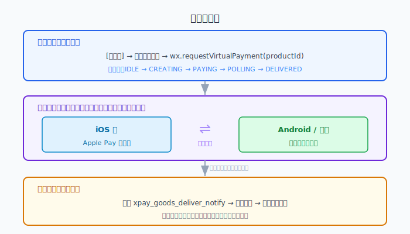
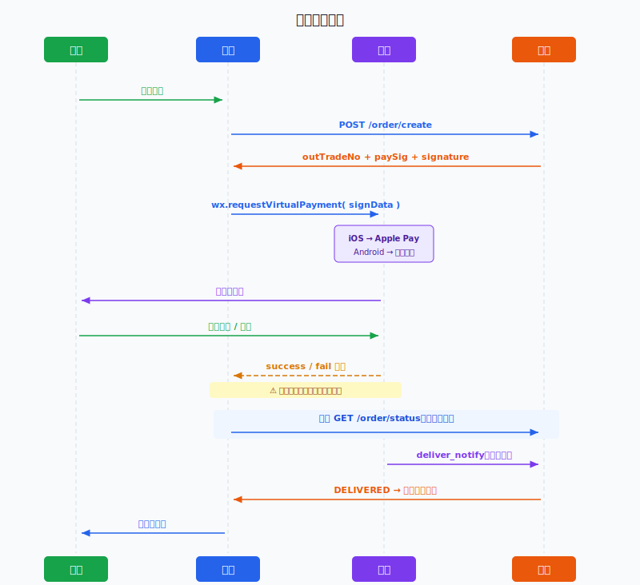
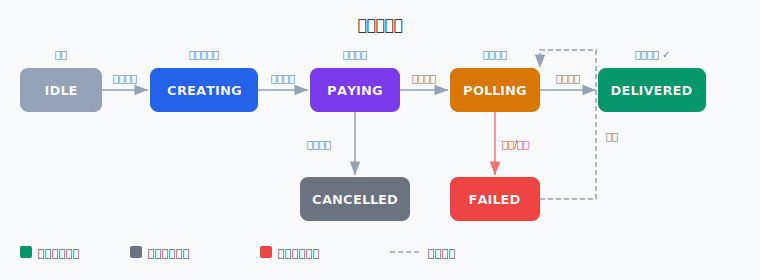
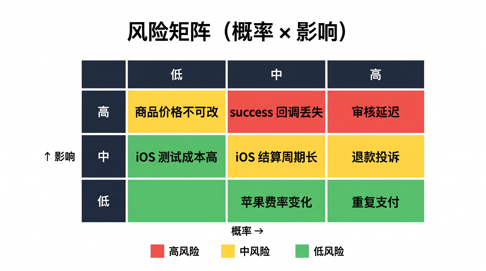

# 微信小程序虚拟商品支付 — 前端技术调研报告

| 项目 | 内容 |
|------|------|
| 调研日期 | 2026-04-27 |
| 调研人 | 前端团队 |
| 文档状态 | ✅ 已定稿，可用于汇报 |
| 适用版本 | 微信基础库 ≥ 2.19.2 / 微信客户端 iOS ≥ 8.0.68 |

---

## 执行摘要（决策者版，30 秒阅读）

产品计划在微信小程序内上线虚拟商品（会员/道具/充值）购买功能。调研共评估 4 种技术路径，**其中 3 种因违反微信或苹果平台规定存在下架封号风险，唯一合规选择为 `wx.requestVirtualPayment`**。该 API 由微信统一封装，前端一套代码自动路由至 iOS（Apple Pay）和 Android（微信支付），无需维护两套逻辑。

**核心成本提示**：iOS 端每笔交易苹果抽取 12%（2026 年腾讯免收服务费），Android 约 0.6%（微信支付手续费，收取方：腾讯），需在定价策略中提前纳入。

**最大风险**：微信虚拟支付资质审核需 1~7 工作日，且商品价格一旦发布不可修改，**需至少提前 2 周推进资质与商品配置工作**，否则将阻塞开发进度。

> ✅ **推荐方案**：`wx.requestVirtualPayment`
>
> **核心理由**：① 平台唯一合规路径，无替代；② 双端统一 API，研发成本最低；③ 原生收银台体验最优
>
> **主要风险**：iOS 苹果税 12% 压缩利润；商品价格不可改，定价需一次到位
>
> **缓解措施**：定价留 15% 余量；iOS 与 Android 可差异化定价
>
> **下一步行动**：立即提交虚拟支付资质申请，同步确认定价策略

---

## 一、背景与问题定义

> **本节回答：我们要解决什么问题，调研边界在哪里？**

### 1.1 业务背景

产品计划在微信小程序内上线虚拟商品购买功能（包含会员订阅、道具直购、代币充值等形态）。**在正式开发前，需明确三个核心问题**：

1. 微信小程序内销售虚拟商品，有哪些合规的支付路径？
2. iOS 与 Android 的技术差异和商业成本如何？
3. 前端实现方案是否可落地，风险是否可控？

### 1.2 范围界定

**在范围内：** 微信小程序原生环境的虚拟商品支付、iOS/Android 双端链路、前端状态管理与异常处理

**不在范围内：** 后端发货逻辑（后端团队负责）、微信小游戏支付（另立文档）、实物商品支付（另立方案）

---

## 二、方案选型

> **本节回答：有哪些技术路径可选，为什么选 A 放弃其他？**

### 2.1 候选方案对比

调研初期共识别 4 种技术路径，逐维度评估如下：

| 对比维度 | **方案 A** `wx.requestVirtualPayment` | 方案 B `wx.requestPayment` | 方案 C WebView + 第三方支付 | 方案 D WebView + JSAPI |
|----------|:--------------------------------------:|:--------------------------:|:---------------------------:|:---------------------:|
| 平台合规性 | ✅ 完全合规 | ❌ 违规（虚拟商品禁用） | ❌ 违规（禁用非微信支付） | ⚠️ 灰色地带 |
| iOS 可用性 | ✅ 原生支持 | ❌ 苹果审核拦截 | ❌ 违反 App Store 规则 | ⚠️ 需额外公众号配置 |
| 前端复杂度 | 低 | 低 | 高（WebView 通信） | 高（JS-SDK 配置） |
| 用户体验 | 原生收银台，最优 | 同左 | 跳出小程序，体验差 | 跳出小程序，体验差 |
| 商品管理灵活性 | 需后台预配置 | 完全动态 | 完全动态 | 完全动态 |
| 封号/下架风险 | 无 | 极高 | 极高 | 高 |
| **综合评价** | **✅ 推荐** | **❌ 不可用** | **❌ 不可用** | **❌ 不推荐** |

### 2.2 选型结论

**选择方案 A，理由如下：**

1. **合规性是硬约束**：微信平台明文规定虚拟商品必须使用虚拟支付，方案 B/C/D 均面临下架或封号风险，属不可接受风险
2. **双端统一，研发成本最低**：一套 API 自动路由 iOS/Android，无需维护两套逻辑
3. **用户体验最优**：原生收银台无页面跳转，支付转化率最高
4. **商品管理限制可接受**：需后台预配置商品，但对会员/道具类产品形态而言约束不大

> **放弃方案 B/C/D 的核心原因**：三者均存在被微信或苹果下架/封号的平台风险，一旦触发将导致整个小程序不可用，业务损失不可接受。

---

## 三、技术方案详解

> **本节回答：选定方案的技术架构是什么，前端如何实现？**

### 3.1 整体架构



### 3.2 完整支付时序



### 3.3 支付状态机

**支付流程有 7 个状态，必须用状态机管理，避免竞态条件：**



| 状态 | 触发条件 | 前端表现 |
|------|----------|----------|
| IDLE | 初始 / 流程结束 | 购买按钮正常可点 |
| CREATING | 点击购买 | 按钮 loading，阻止重复点击 |
| PAYING | 收银台弹出 | 等待用户操作 |
| POLLING | success 回调触发 | 显示"发放中" loading |
| DELIVERED | 后端确认发货 | 跳转成功页 |
| CANCELLED | 用户取消 | 恢复按钮，轻提示 |
| FAILED | 支付失败 / 轮询超时 | 展示原因，提供重试 |

### 3.4 核心代码实现

```typescript
type PaymentStatus =
  | 'IDLE' | 'CREATING' | 'PAYING'
  | 'POLLING' | 'DELIVERED' | 'CANCELLED' | 'FAILED'

class VirtualPaymentManager {
  private status: PaymentStatus = 'IDLE'
  private currentTradeNo: string | null = null
  onStatusChange?: (status: PaymentStatus) => void

  async purchase(productId: string): Promise<void> {
    // 并发锁：状态非 IDLE 时拒绝重复请求
    if (this.status !== 'IDLE') return

    try {
      this.setStatus('CREATING')
      // 后端创建订单，同时计算 paySig 和 signature，前端仅做透传
      // outTradeNo 格式：8~32位，仅支持数字/大小写字母/_-|@，不能以 _ 开头
      const { outTradeNo, offerId, mode, paySig, signature } = await createOrder(productId)
      this.currentTradeNo = outTradeNo

      this.setStatus('PAYING')
      await this.invokePayment({ productId, outTradeNo, offerId, mode, paySig, signature })

      this.setStatus('POLLING')
      wx.showToast({ title: '支付成功，权益发放中...', icon: 'loading', duration: 30000 })
      await this.pollDeliverStatus(outTradeNo)

    } catch (err: any) {
      this.handleError(err)
    }
  }

  private invokePayment(params: {
    productId: string
    outTradeNo: string
    offerId: string    // 虚拟支付后台的米大师应用 ID（offerid）
    mode: 'short_series_goods' | 'short_series_coin'
    paySig: string     // ⚠️ 必须由后端计算：HMAC-SHA256(appKey, "requestVirtualPayment&" + signData)
    signature: string  // ⚠️ 必须由后端计算：HMAC-SHA256(session_key, signData)
  }): Promise<void> {
    return new Promise((resolve, reject) => {
      const env = __wxConfig.envVersion === 'release' ? 0 : 1 // ⚠️ iOS 不支持沙箱(env=1)，线上固定为 0

      // signData 是所有支付参数的 JSON 字符串
      // 必须与后端计算 paySig / signature 时使用的 signData 完全一致（字段顺序也要一致）
      const signData = JSON.stringify({
        offerId: params.offerId,
        buyQuantity: 1,
        env,
        currencyType: 'CNY',
        productId: params.productId,
        outTradeNo: params.outTradeNo,
        attach: params.outTradeNo, // 透传数据，发货通知时原样返回，必填
      })

      wx.requestVirtualPayment({
        signData,                      // JSON 字符串，包含全部支付参数
        mode: params.mode,             // 'short_series_goods' 或 'short_series_coin'
        paySig: params.paySig,         // 后端透传，前端不计算
        signature: params.signature,   // 后端透传，前端不计算
        success: () => resolve(),
        fail: (err) => reject(err),
      })
    })
  }

  private async pollDeliverStatus(outTradeNo: string): Promise<void> {
    const MAX_RETRY = 8
    const BASE_DELAY = 1000

    for (let i = 0; i < MAX_RETRY; i++) {
      // 指数退避：1s → 2s → 4s → 8s → ... 上限 16s
      await sleep(Math.min(BASE_DELAY * Math.pow(2, i), 16000))

      // 用户切后台时挂起轮询，回到前台继续
      await this.waitForVisible()

      const { status } = await queryDeliverStatus(outTradeNo)

      if (status === 'DELIVERED') {
        this.setStatus('DELIVERED')
        wx.hideToast()
        wx.navigateTo({ url: '/pages/deliverSuccess/index' })
        return
      }
      if (status === 'FAILED') throw new Error('DELIVER_FAILED')
    }

    // 轮询超时，降级引导用户去订单页查看
    this.setStatus('IDLE')
    wx.hideToast()
    wx.showModal({
      title: '权益发放中',
      content: '稍后请在「我的订单」中查看结果',
      showCancel: false,
    })
  }

  private handleError(err: any): void {
    wx.hideToast()
    const msg = err?.errMsg ?? ''
    const code = err?.errCode
    if (code === -2 || msg.includes('cancel')) {
      this.setStatus('CANCELLED')
      wx.showToast({ title: '已取消支付', icon: 'none' })
    } else if (msg.includes('DELIVER_FAILED')) {
      this.setStatus('FAILED')
      wx.showToast({ title: '权益发放失败，请联系客服', icon: 'none' })
    } else {
      this.setStatus('FAILED')
      reportError('virtual_pay_error', { msg, tradeNo: this.currentTradeNo })
      wx.showToast({ title: '支付失败，请重试', icon: 'none' })
    }
    setTimeout(() => this.setStatus('IDLE'), 1500)
  }

  private setStatus(s: PaymentStatus): void {
    this.status = s
    this.onStatusChange?.(s)
  }

  // 用户切后台时挂起轮询
  private waitForVisible(): Promise<void> {
    return new Promise(resolve => wx.onAppShow(() => resolve()))
  }

  // onShow 恢复：用户重新进入页面时检查未完成订单
  resumeIfPending(): void {
    const tradeNo = wx.getStorageSync('pendingTradeNo')
    if (tradeNo) this.pollDeliverStatus(tradeNo)
  }
}

const sleep = (ms: number) => new Promise(r => setTimeout(r, ms))
```

**页面生命周期接入：**

```typescript
onShow() {
  this.payManager.resumeIfPending()  // 恢复未完成的发货轮询
}
onHide() {
  if (this.payManager.currentTradeNo) {
    wx.setStorageSync('pendingTradeNo', this.payManager.currentTradeNo)
  }
}
```

---

## 四、商品模式选型

> **本节回答：道具直购 vs 代币充值，如何选择？**

| 对比维度 | 道具直购 | 代币充值 |
|----------|----------|----------|
| 用户心智 | 简单直接，所见即所得 | 需理解代币体系，有学习成本 |
| 适合场景 | 会员、课程、单次解锁 | 游戏道具、高频小额消费 |
| 定价灵活性 | 每个商品独立定价 | 充值档位固定，消费侧灵活 |
| iOS 退款处理 | 撤销权益，逻辑清晰 | 需回退代币余额，逻辑复杂 |
| 促销活动 | 需提前在后台配置新档位 | 调整代币汇率即可 |
| **推荐场景** | **SaaS / 内容产品** | **游戏 / 社交 / 高频消费** |

---

## 五、iOS / Android 差异与成本分析

> **本节回答：双端差异有多大，对定价策略有什么影响？**

### 5.1 双端差异对比

| 项目 | Android | iOS | 应对策略 |
|------|:-------:|:---:|----------|
| 支付通道 | 微信支付 | Apple Pay | 微信自动路由，无需前端处理 |
| 沙箱测试 | ✅ | ❌ | iOS 用专用测试商户号，人工核销 |
| 开发者主动退款 | ✅ | ❌（用户去 App Store 申请） | iOS 退款页单独设计，引导入口 |
| 结算周期 | T+3 | 自然月 +30~50 天 | 财务提前规划，iOS 收入单独台账 |
| 平台费率（2026） | ~0.6% | **12%**（腾讯免收） | 差异化定价或预留损耗空间 |
| 平台费率（标准） | ~0.6% | **17%**（苹果 12% + 腾讯 5%） | 2026 年后重新评估定价策略 |

### 5.2 成本模型（以用户付款 ¥100 为例）

```
Android   →  ¥99.4 到手  （微信支付手续费 0.6%，收取方：腾讯）
iOS 2026  →  ¥88.0 到手  （苹果税 12%，收取方：苹果；腾讯 2026 年限时免收）
iOS 标准  →  ¥83.0 到手  （苹果 12%，收取方：苹果 + 腾讯 5%，收取方：腾讯）
```

### 5.3 定价策略三选一

| 策略 | 做法 | 适用场景 |
|------|------|----------|
| 统一定价 | iOS/Android 同价，接受 iOS 利润差 | 用户基础偏 Android，iOS 量小 |
| 差异化定价 | iOS 档位上浮 15%，前端区分展示 | iOS 用户占比高，利润敏感 |
| 仅 Android 开放 | iOS 展示说明文案，不上线购买 | 产品初期，降低合规复杂度 |

---

## 六、风险评估

> **本节回答：有哪些风险，哪些必须现在处理？**

### 6.1 风险矩阵（概率 × 影响）



### 6.2 风险明细与缓解措施

| 风险 | 概率 | 影响 | 等级 | 缓解措施 |
|------|:----:|:----:|:----:|----------|
| 商品价格发布后不可修改 | 必然 | 高 | 🔴 | 上线前充分评审定价策略，发布前沙箱验证 |
| `success` 回调丢失，用户误以为未支付 | 中 | 高 | 🔴 | 指数退避轮询 + `onShow` 恢复机制 + 订单页兜底 |
| 虚拟支付资质审核延迟（1~7 工作日） | 中 | 高 | 🔴 | **提前 2~4 周申请**，设置备用上线日期 |
| iOS 沙箱不可用，测试成本高 | 必然 | 中 | 🟡 | 申请专用测试商户号，录制测试过程存档 |
| iOS 结算周期长（最长 2 个月） | 必然 | 中 | 🟡 | 财务提前规划现金流，iOS 收入独立核算 |
| 苹果费率政策变化 | 低 | 高 | 🟡 | 定价预留余量，关注苹果开发者政策 |
| 重复支付（网络抖动） | 低 | 高 | 🟡 | 前端并发锁 + 后端幂等校验 `outTradeNo` |
| iOS 退款流程复杂引发用户投诉 | 中 | 中 | 🟡 | 支付前告知用户退款须知，完善客服 SOP |

**🔴 高等级风险（3 项）需在开发启动前完成处置。**

---

## 七、监控设计

> **本节回答：上线后如何感知支付链路的健康状况？**

### 7.1 支付漏斗埋点

```typescript
trackEvent('pay_start',       { productId, platform })              // 点击购买
trackEvent('pay_open',        { productId, platform })              // 收银台弹出
trackEvent('pay_success',     { productId, platform, outTradeNo }) // 支付成功
trackEvent('pay_cancel',      { productId, platform })              // 用户取消
trackEvent('pay_fail',        { productId, platform, errCode })    // 支付失败
trackEvent('deliver_done',    { outTradeNo, pollCount })            // 发货成功
trackEvent('deliver_timeout', { outTradeNo })                       // 轮询超时
```

### 7.2 核心监控指标与告警阈值

| 指标 | 计算方式 | 告警阈值 |
|------|----------|----------|
| 支付成功率 | `pay_success / pay_open` | < 85% 触发告警 |
| 发货成功率 | `deliver_done / pay_success` | < 98% 触发告警 |
| 平均轮询次数 | 反映后端发货速度 | 均值 > 5 需排查后端 |
| iOS vs Android 成功率差 | 对比双端异常 | 差异 > 10% 需排查 |

---

## 八、POC 验证计划

> **本节回答：开发前需要验证哪些关键假设？**

| # | 验证项 | 验证方式 | 通过标准 |
|---|--------|----------|----------|
| 1 | 虚拟支付资质可开通 | 提交申请，等待审核结果 | 获得虚拟支付商户号 |
| 2 | Android 全链路（沙箱） | 真机 + 沙箱，走完支付→发货 | 各环节状态正常流转 |
| 3 | iOS 全链路（现网） | 真机 + 正式环境，最小金额商品 | Apple Pay 正常弹出，发货成功 |
| 4 | `success` 回调丢失场景 | 支付后强制 kill 微信，重新进入 | 订单状态正确恢复 |
| 5 | 重复点击防护 | 连续快速点击 5 次购买按钮 | 只产生 1 笔订单 |

---

## 九、落地计划

> **本节回答：什么时候做什么，谁来做？**

```
Week 1 — 前置准备（不卡则不开始 Week 2）
  ├── [产品/运营] 提交虚拟支付资质申请
  ├── [产品] 确认定价策略（统一 / 差异化 / 仅 Android）
  └── [产品/后端] 在微信后台配置商品，获取 productId

Week 2 — 开发实现
  ├── [前端] 实现 VirtualPaymentManager（状态机 + 轮询）
  ├── [前端] 完成商品档位页面 UI
  ├── [前端] 接入监控埋点
  └── [后端] 实现发货推送接收接口 + 订单状态查询接口

Week 3 — 测试验证
  ├── Android 沙箱全链路测试
  ├── iOS 真机现网测试（POC 5 项逐一通过）
  └── 异常场景测试（网络中断 / kill 进程 / 重复点击）

Week 4 — 灰度上线
  ├── 灰度放量 10%，观察支付/发货成功率
  ├── 确认监控告警正常工作
  └── 无异常后全量放开
```

---

## 十、前置准备清单

> **以下事项不属于前端工作，但会直接阻塞开发，需至少提前 2 周推进**

- [ ] 小程序主体为企业 / 个体工商户（**个人主体无法开通**）
- [ ] 微信公众平台申请「虚拟支付」能力（审核 1~7 工作日）
- [ ] 虚拟支付后台配置所有商品，获取各 `productId`（**价格发布后不可修改**）
- [ ] 小程序配置「简称」（iOS Apple Pay 展示的 display name 要求）
- [ ] 后端实现发货推送接收接口（`xpay_goods_deliver_notify`）
- [ ] 后端实现订单状态查询接口（供前端轮询兜底）
- [ ] 申请 iOS 专用测试商户号（用于现网真实支付测试）

---

## 附录

### A. 参考文档

- [微信小程序虚拟支付官方文档](https://developers.weixin.qq.com/miniprogram/dev/platform-capabilities/business-capabilities/virtual-payment.html)
- [虚拟支付 iOS 端接入](https://developers.weixin.qq.com/miniprogram/dev/platform-capabilities/business-capabilities/virtual-payment/ios.html)
- [wx.requestVirtualPayment API](https://developers.weixin.qq.com/miniprogram/dev/api/payment/wx.requestVirtualPayment.html)
- [虚拟支付业务运营规范](https://developers.weixin.qq.com/miniprogram/product/virtual_payment.html)

### B. 商品档位数据规范

```typescript
interface VirtualProduct {
  productId: string  // 与微信后台严格对应，不可动态生成
  label: string
  price: number      // 单位：元，仅展示用，实际扣费以后台配置为准
  badge?: string
}

// ⚠️ 商品列表由后端接口返回，不硬编码在前端
// 后端从微信虚拟支付后台同步，确保价格一致性
const fetchProducts = (): Promise<VirtualProduct[]> =>
  request('/api/virtual/products')
```

### C. 版本兼容要求

| 端 | 最低版本要求 |
|----|------------|
| iOS 微信客户端 | ≥ 8.0.68 |
| Android 微信基础库 | ≥ 2.19.2 |
| 鸿蒙 微信基础库 | ≥ 2.19.2 |
| Windows 微信 | 同 Android |
