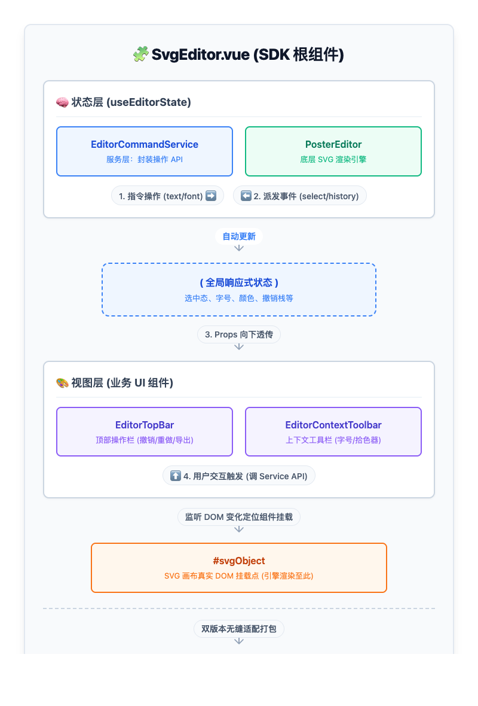

# SVG 简易编辑器 SDK (wk-web-65280) 阶段性研发汇报

**汇报人：** [您的名字]
**项目分支：** `wk-web-65280`
**当前状态：** SDK 基础建设与核心功能已全部完成，等待底层 API 就绪即可闭环全部高级交互。

---

## 一、 本期核心工作成果（已完成）

本次迭代实现了 SVG 简易编辑器 SDK **从 0 到 1 的基础建设**，并成功实现了与底层渲染引擎的对接。具体产出如下：

### 1. 坚实的技术基建 (Engineering)
*   **架构选型：** 搭建基于 `pnpm workspace` 的 Monorepo 架构。
*   **跨框架支持：** 核心逻辑抽离，通过双适配层（`packages/vue2` 与 `packages/vue3`）实现一套代码支持不同 Vue 版本，最大化组件复用率。
*   **开发效能：** 搭建完整的开发调试环境（Playground），包含统一的 ESLint 代码规范、Husky 提交拦截及自动化构建脚本。

### 2. 核心编辑能力 (Core Features)
*   **引擎接入与生命周期：** 成功接入底层 `@baidu/orion-svg-sample-editor`，实现了自适应画布缩放（ResizeObserver）及完整的生命周期管理。
*   **文本编辑核心：** 支持新增文本节点、进入/退出行内编辑状态。
*   **历史与状态管理：** 实现完备的撤销/重做机制，并与 UI 栈大小实现响应式联动。
*   **富文本属性：**
    *   **字号：** 支持精准读取、步进增减以及预设列表选择。
    *   **颜色：** 集成完整的 HSV 拾色器，支持主题色板及“最近使用色”的持久化存储。
*   **多格式导出：** 完成标准 SVG 导出（补齐 XML 命名空间规范），以及 PNG 异步导出（支持 Base64、防重入处理）。

### 3. 高级 UI 交互层 (UI & UX)
*   **智能上下文工具栏 (`EditorContextToolbar`)：** 基于 `ResizeObserver` + `MutationObserver`，实现工具栏对选中元素的**实时精准跟随**；具备智能边缘碰撞检测（优先上方，越界自动翻转）。
*   **模块化组件：** 封装了独立且高复用的组件，如顶部操作栏、文本工具栏、独立拾色器、字号及导出下拉面板等，且支持 Slot 灵活扩展。

---

## 二、 整体方案架构设计

项目采用**严格的分层解耦设计**，确保 SDK 的高可维护性与易扩展性：

1. **状态层 (`useEditorState`)：** 作为唯一持有底层实例（PosterEditor）的模块，负责拦截底层事件并维护响应式的全局状态。
2. **服务层 (`EditorCommandService`)：** 对底层 API 做了面向业务的二次封装，统一命令的命名空间。
3. **视图层 (UI 组件)：** 纯展示与交互组件，**绝不直接操作底层实例**。通过触发服务层的 Command 完成动作，并通过状态层回读实现 UI 同步。
4. **适配层 (Vue2/3)：** 采用零成本重导出（Re-export）机制，根据宿主环境打出对应版本的 npm 包。

---

## 三、 后续规划与需协调的支持 (Blockers & Next Steps)

当前 SDK 侧的代码框架、UI 占位及数据链路均已就绪。为达成最终全量上线，**急需以下外部团队/底层能力的协同支持**：

### 1. 需底层组件支持的 API 能力

| 待补齐功能 | 状态 | 所需依赖方 |
| :--- | :--- | :--- |
| **基础文本样式** (加粗/斜体/下划线/删除线) | UI 已占位，API 待接入 | `@baidu/orion-svg-sample-editor` 团队 |
| **画布视图控制** (放大/缩小/左转/右转) | 服务层已占位，API 待接入 | `@baidu/orion-svg-sample-editor` 团队 |
| **文件导出** (导出 PPTX) | UI 菜单已预留，API 待接入 | `@baidu/orion-svg-sample-editor` 团队 |
| **其他图元工具栏** (图片/形状的悬浮菜单) | 针对图片/形状的选区已做预留 | 需根据产品规划确定是否支持及底层 API |

### 2. 需业务消费方协同 (对接方支持)
| 协同事项 | 具体要求 | 负责方 |
| :--- | :--- | :--- |
| **端侧接入联调** | 需消费方按照 SDK 规范传入 `svgHtml`、`editStatus`，并对接各类导出事件完成闭环。 | 相关业务前端团队 |
