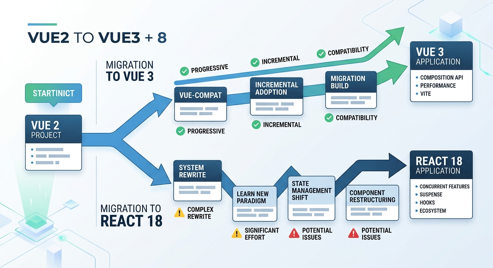

# Vue2 升级选型方案：Vue3 vs React 18 调研报告

> **整体评价**：
> 本次选型的核心在于平衡“短期业务交付压力”与“长期技术生态演进”。React 18 在绝对生态和复杂业务的上限更高，但考虑到团队现有技术栈基因，强行切换的阵痛期过长。Vue3 的渐进式升级策略在当前阶段是 ROI（投资回报率）最高的选择。
> 
> **优化建议**：
> 1. **弱化框架优劣论**，强调**ROI 和业务连续性**。
> 2. 增加升级 Vue3 过程中的**包体积暴增风险及应对策略**。
> 3. 补充**微前端渐进式重构**的具体分层落地思路。

---

## 1. 背景与目标

随着 Vue2 于 2023 年底正式停止维护（EoL），现网项目面临着安全漏洞无法修复、周边生态库（如 Vue Router, Vuex）停止兼容更新的双重困境。同时，随着业务复杂度的上升，Vue2 较弱的 TypeScript 支持也成为了团队协作的瓶颈。

本次调研旨在为团队后续的底层框架演进提供决策依据，重点对比目前最主流的两大方案：**平滑升级至 Vue3** 与 **彻底重构为 React 18**。

## 2. 核心对比维度分析

### 2.1 迁移成本与业务连续性（关键决策点）
- **升级 Vue3**：
  - **优势**：心智模型高度继承。可通过 `@vue/composition-api` 插件在现有 Vue2 项目中提前演练 Composition API，配合 Vue 2.7 甚至可以实现无缝的语法过渡。模板语法（Template）基本无需改动。
  - **风险**：若直接采用 Vue3 + Vite + TypeScript 的全家桶组合，部分陈旧的第三方 Vue2 组件库可能面临不兼容，导致打包体积在过渡期暴涨。
- **重构 React 18**：
  - **优势**：一次性解决历史技术债。
  - **风险**：极高的业务停摆风险。团队需要重新适应 JSX/TSX 心智，彻底替换状态管理（从 Vuex 走向 Redux/Zustand）和路由。学习曲线陡峭，短期内大概率导致业务需求积压。

### 2.2 底层性能与渲染机制
- **Vue3**：
  - 采用基于 `Proxy` 的响应式追踪，解决了 Vue2 中 `Object.defineProperty` 无法检测对象新增属性和数组索引变更的痛点。
  - 配合编译时的“静态提升”（Static Hoisting）和“按需补丁”（Patch Flags），极大优化了运行时的 Diff 开销。
- **React 18**：
  - 引入了强大的 Concurrent Mode（并发模式）和自动批处理（Auto Batching），上限极高。
  - 但其“全量重绘”的默认机制要求开发者必须手动进行极细粒度的性能优化（如频繁使用 `useMemo`, `useCallback`），增加了团队的代码审查心智负担。

### 2.3 生态兼容性与长期维护性
- **生态成熟度**：React 依然占据全球统治地位，尤其是在复杂中后台（如 Ant Design）、SSR（Next.js）等领域优势明显。
- **Vue3 生态补齐**：经过几年的发展，Element Plus、Pinia（取代 Vuex）、Vite 等生态已完全成熟，足以支撑大型企业级应用。

### 2.4 DX（开发体验）与 TypeScript 支持
两者目前都有卓越的 TS 支持。虽然 React 的 JSX 具有天生的 TS 类型推导优势，但 Vue3 重写后配合 `<script setup>` 语法及 Volar 插件，已经在 IDE 体验上补齐了短板，开发效率极高。

---

## 3. 技术演进路线图

为了向团队清晰地展示两种方案在实施路径上的区别，我绘制了以下架构演进对比图：

*(注：上图展示了从 Vue2 出发，上方平缓的蓝色路径代表渐进式升级至 Vue3，下方陡峭的路径代表彻底重构为 React 18 的阵痛期。)*

## 4. 实施路径与风险应对（微前端渐进式落地方案）

为了避免“一次性大重构”带来的灾难性后果，建议采用以下落地路径：

1. **基础设施隔离**：引入 qiankun 或无界（Wujie）等微前端框架，将原 Vue2 项目作为基座应用（或子应用之一）冻结。
2. **增量开发**：所有新业务模块全部采用 Vue3 + TypeScript 独立开发，作为新的子应用接入。
3. **逐步绞杀（Strangler Pattern）**：按业务低频访问区 -> 核心高频区的顺序，逐步用 Vue3 模块替换旧的 Vue2 页面，最终下线旧基座。
4. **包体积控制**：在过渡期，严格限制公共依赖的重复打包，利用 Webpack/Vite 的 External 机制或 Module Federation 共享基础依赖（如 Vue 运行时）。

## 5. 结论

综合考量团队现有的技术栈基因（Vue 熟练度高）、业务高频迭代的现状以及整体 ROI，**强烈建议选择升级至 Vue3 的路线**。它能在不中断现有业务交付的前提下，补齐性能与工程化（TypeScript）的短板。
